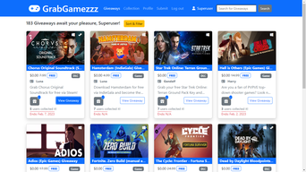
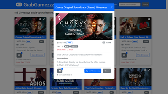

# GrabGamezzz

  

GrabGamezzz is a game giveaway website for true game lovers that provides free game stuff generously issued by game creators, including whole games, early access to emerging game titles, downloadable game contents, add-ons, upgrades, packages, patches, secret keys and much more.

## Distinctiveness and Complexity

GrabGamezzz employs an open-source API kindly offered by gamerpower.com. Data received in json format are used to populate the project’s own database. The database is updated on a daily basis. In doing so, each giveaway is randomly assigned an author and users who collected it from among users registered at GrabGamezzz. Of course, any registered user can submit a new giveaway or collect the existing one manually using the project’s submit and collect functions respectively.

GrabGamezzz features an eye-catching, graphic-intensive and web-responsive design that employs such components as a sticky webpage header containing a clickable logo, collapsible navigation bar and search form, full of details giveaway cards, giveaway view modal, sort and filter form with accordions, checks and radios found offcanvas, pagination, various icons, badges, tooltips, etc.

The project’s frontend is based on extensive use of Bootstrap toolkit, own cascading style sheets, font awesome icons and is powered by JavaScript. Some not frequently found elsewhere features (e.g., multiline text truncate and positioning of icons and inscriptions over images in giveaway cards) are also included.  

It is worth to mention the project’s comprehensive search, sort and filter capabilities allowing to search among dozens of giveaway titles, sort and filter all available giveaways or only limited giveaway sets such as search results or user’s collection. Query results are reflected in a dynamically generated information string that shows not only the number of giveaways found, but query parameters as well.

In addition to the above capabilities, registered users can maintain their own collection of selected giveaways, change their personal data and password, and submit a new giveaway offer.

## Specification

GrabGamezzz website consists of the following pages.
**Giveaways page** is a home page where all giveaways are displayed split in pages and sorted by publication date in descending order by default. It allows for searching, sorting and filtering the giveaways with use of the below described components:
- **Webpage header** accommodates a clickable website logo and collapsible navigation bar. Authenticated users can see their username therein linked to their profile. For Giveaways and Collection pages the header includes a Giveaway Search form.
- **Giveaway Search form** enables the search of a query string in giveaway titles recorded in the database.
- **Information string** is found below the webpage header on Giveaways and Collection pages. It shows the number of giveaways in total (for Giveaways page), in user’s collection (for Collection page) or that corresponding to search, sort and filter query along with query parameters (in case of such query). It is generated dynamically in response to corresponding request or query.
- **Giveaway card** contains a giveaway image with appropriate game platform icons, if any, positioned over it, giveaway title truncated to fit in a single line, original price, if available, giveaway type, author, description truncated to two lines to keep the same size of all giveaway cards, Add to/Remove from Collection button and number of users who collected the giveaway, View Giveaway button and the giveaway expiry date, if available.
As soon as a giveaway gets expired, which is checked by comparing its expiry date against the current date, its image and title are made black and white, the Expired Stamp is applied over the giveaway card and all card buttons are disabled. All these features are implemented with use of JavaScript.
- **Giveaway Add to/Remove from Collection button** implements the respective functionality through JavaScript Fetch API and changes its appearance depending on its state.
- **Giveaway view** is called by clicking on the View Giveaway button. It appears in a popup window and does not require any server request since it is implemented using JavaScript and takes all information from html code, including data shown on the giveaway card as well as giveaway instructions and actual link initially concealed from the user. This view can be accessed only by authenticated users. Other users are redirected to the Login page.
- **Sort & Filter form** appears offcanvas in response to clicking on Sort & Filter button found next to the information string. It allows sorting the giveaways by expiry date, publication date, title and worthiness in ascending or descending order as well as filtering the giveaways by 19 game platforms split in 4 groups, status determined based on expiry date, where available, and the giveaway type.
- **Pagination** is implemented using the Django’s built-in Paginator class. Upon page loading, all pagination links are adjusted with account of query string parameters, if any, using JavaScript.
- **Webpage footer** contains standard copyright information.

**Collection page** resembles the Giveaways page in both the appearance and the functionality, but the giveaway set it operates with is limited to the giveaways found in the user’s collection.

**Profile page** allows the user to change its personal data using the prefilled form, and change the user’s password with use of another form.

**Submit page** helps to submit a new giveaway.

**Login** and **Register pages** are used to log in and register a user respectively.

## Created files contents

*context_processors.py* contains global context data used to automate some html code writing.

*favicon.ico* is the website icon.

*giveaways_thumbnail-1.png* and *giveaways_thumbnail-2.png* are the website thumbnails used in this document.

*grabgamezzz.css* is the website’s cascading style sheets.

*grabgamezzz.js* contains JavaScript functions used to view giveaway contents, process expired giveaways, implement collection functionality, adjust pagination links, redirect to Login page, raise alerts, etc.

*index.html* extends *layout.html* and includes giveaway card, giveaway view, pagination and sort & filter sections, all of which are implemented in the form of separate html files (*giveaway_card.html*, *giveaway_view_modal.html*, *pagination.html* and *sort_filter_offcanvas.html* respectively) for better readability and maintenance.

*layout.html* is a template containing all meta data, links to external and internal resources, webpage header and footer.

*login.html*, *profile.html*, *register.html* and *submit.html* files contain corresponding pages described above.

*README.md* is this file.

*no_image.png* is an image placeholder in case a user does not specify image URL when submitting a giveaway.

## How to run the application

Nothing special. Just run it as all other Django web applications.
